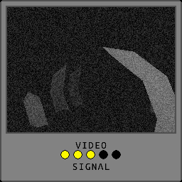

# Project Throwback

A spooky game made for raylib 9 YEARS gamejam.

## Controls 

Arrow keys - walk and look
Q - Take photo

Use Enter in menus to confirm.

## Screenshots
| | |
|:-------------------------:|:-------------------------:|
| |  |
| |  |

## License
All code is distributed under the GPLv3 license, however, the assets are not and copyrighted material except for audio.

